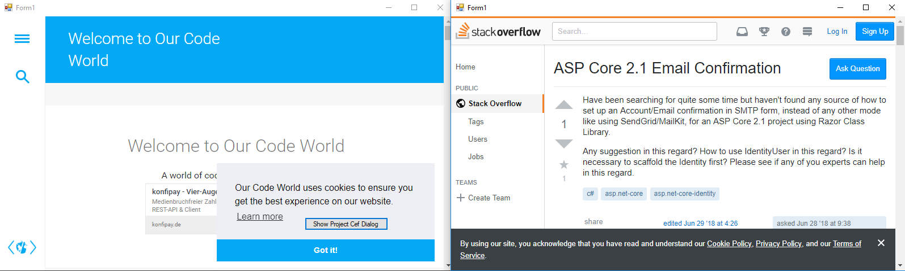
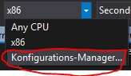
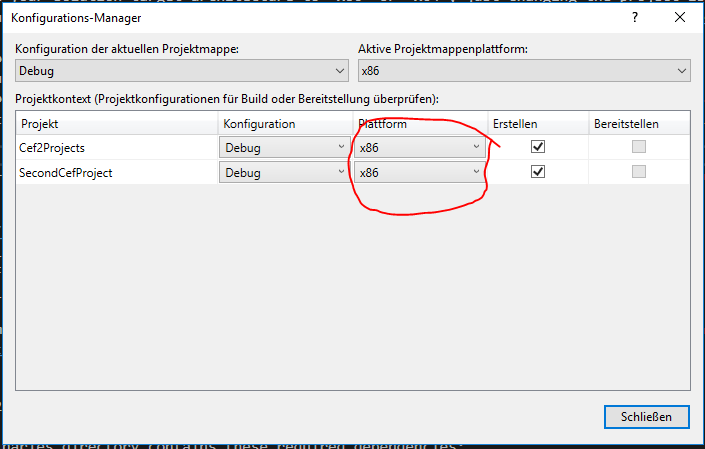

# Running two CefSharp Projects at the same time




## How To

In order to use two CefSharp Projects at the same time you have to make sure that `Cef` is initialized only once.

In the second project this could look something like this:

```C#
public SecondForm(ChromiumWebBrowser chromeBrowser = null)
{
    InitializeComponent();

    var _cefIsInternal = chromeBrowser == null;
    _chromeBrowser = chromeBrowser;

    if (_cefIsInternal)
    {
        CefSettings settings = new CefSettings();
        Cef.Initialize(settings);
        _chromeBrowser = new ChromiumWebBrowser("http://www.nsbloggers.com/index.cfm");
        this.FormClosing += Form1_FormClosing;
    }

    this.Controls.Add(_chromeBrowser);
    _chromeBrowser.Dock = DockStyle.Fill;
}

private void Form1_FormClosing(object sender, FormClosingEventArgs e)
{
    Cef.Shutdown();
}
```

Also make sure that either both projects support any CPU or Both projects use x86 or x64.


